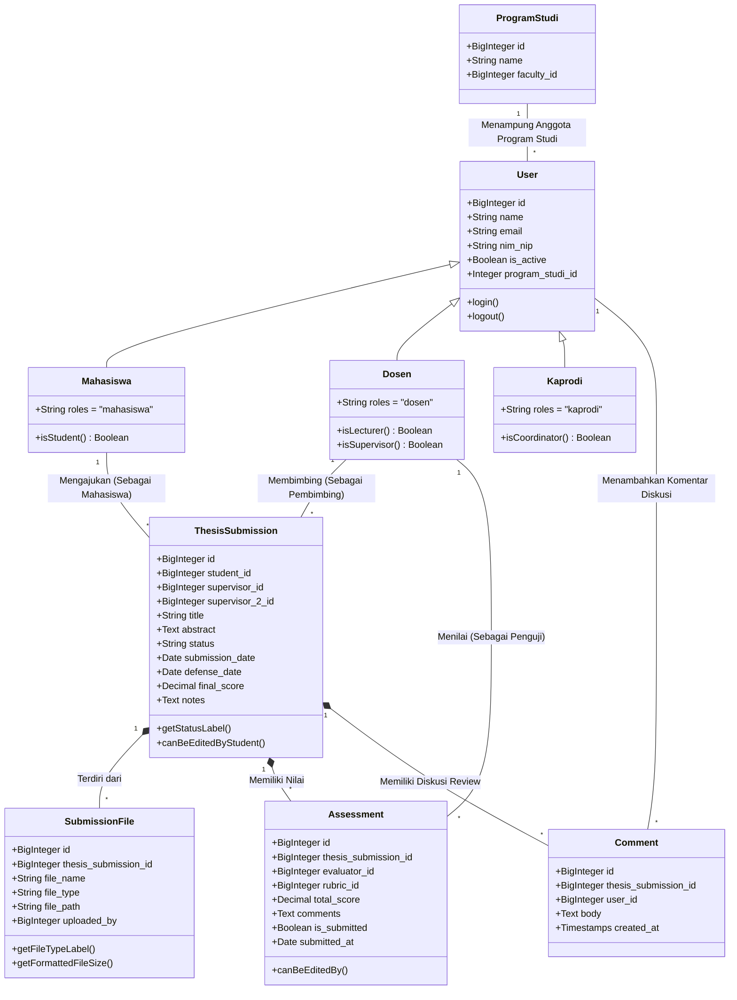

# Class Diagram

Diagram ini menggambarkan entitas utama penyusun sistem beserta properti pokok dan strukturnya. Tidak mencakup fitur manajemen hak akses admin agar fokus pada proses pengajuan. Entitas Pengguna (User) secara hierarkis dibedakan berdasarkan perannya (Mahasiswa, Dosen, Kaprodi) untuk memperjelas batas fungsi masing-masing.

