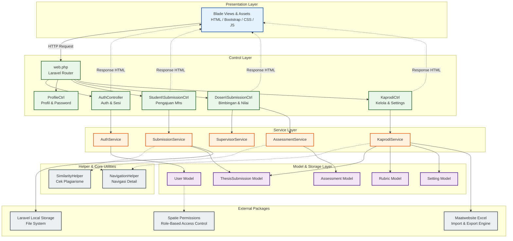

# Component Diagram

Component Diagram menggambarkan arsitektur modular perangkat lunak sistem pengajuan Tugas Akhir. Sistem ini menggunakan arsitektur **MVC (Model-View-Controller) dengan Service & Helper Layer** untuk memisahkan antarmuka pengguna, logika kontrol, logika bisnis, dan akses data secara bersih.

---

## 📊 Component Diagram (Mermaid Diagram)

---

## 📝 Penjelasan Detail Komponen Sistem

1. **Presentation Layer (User Interface):**
   * **`Blade Views`**: Kumpulan berkas template `.blade.php` (frontend) yang menyajikan tampilan dashboard, form pengajuan, form penilaian, dan halaman laporan cetak kepada aktor (Mahasiswa, Dosen, Kaprodi) di browser.

2. **Control Layer (Routing & Controller):**
   * **`web.php`**: Menerima request HTTP dari browser dan mengarahkannya ke Controller yang sesuai berdasarkan pola URL.
   * **`Controllers`**: Berfungsi sebagai pengontrol alur aplikasi. Tugas utamanya adalah memvalidasi data masukan form (`Request`), memanggil logika bisnis di Service Layer, dan mengembalikan respon HTML/View yang sesuai.

3. **Service Layer (Logika Bisnis Terpusat):**
   * Lapisan terpenting yang menampung semua aturan bisnis (*business rules*). Contoh:
     * **`SubmissionService`**: Mengatur validasi batas deadline, penghitungan kuota pengajuan per batch (`max_batches` & `attempts_per_batch`), serta penyimpanan berkas fisik proposal.
     * **`AssessmentService`**: Mengatur proses perhitungan nilai rata-rata proposal dan detail sub-kriteria.

4. **Helper Components:**
   * **`SimilarityHelper`**: Berfungsi khusus untuk melakukan kalkulasi string `similar_text` guna mencocokkan judul proposal dengan arsip sejarah proposal.
   * **`NavigationHelper`**: Membantu memfasilitasi tombol navigasi *Previous/Next* saat Kaprodi/Dosen melihat detail data mahasiswa secara berurutan.

5. **Model & Storage Layer (Persistensi Data):**
   * **`Eloquent Models`**: Objek representasi tabel database yang mengurus pengambilan, penyuntingan, dan relasi data secara aman.
   * **`Storage System`**: Mengatur berkas proposal fisik yang disimpan di disk lokal server (`storage/app/private/` atau `storage/app/public/`).

6. **External Integration Packages:**
   * **`Maatwebsite Excel`**: Komponen mesin utama untuk membaca berkas Excel saat Kaprodi melakukan impor data mahasiswa/dosen, serta memformat lembar Excel saat melakukan ekspor data.
   * **`Spatie Permissions`**: Menangani otorisasi hak akses (*Role-Based Access Control*) guna memastikan Mahasiswa tidak dapat mengakses halaman Kaprodi, dan sebaliknya.
