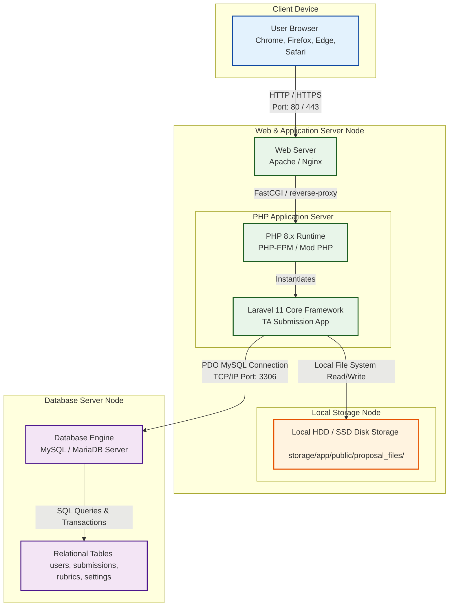

# Deployment Diagram

Deployment Diagram menggambarkan infrastruktur fisik tempat sistem pengajuan Tugas Akhir dijalankan dan disebarkan (*deployed*). Konfigurasi di bawah ini mencerminkan lingkungan server web standar yang digunakan untuk menjalankan aplikasi berbasis Laravel 11.

---

## 📊 Deployment Diagram (Mermaid Diagram)

---

## 📝 Penjelasan Detail Infrastruktur Fisik

1. **Client Device (Perangkat Pengguna):**
   * **`User Browser`**: Perangkat komputer, laptop, atau smartphone milik Mahasiswa, Dosen, dan Kaprodi. Mereka berinteraksi dengan sistem menggunakan peramban web modern (Google Chrome, Mozilla Firefox, Microsoft Edge, atau Safari) dengan mengirimkan permintaan HTTP/HTTPS.

2. **Web & Application Server Node (Server Web & Aplikasi):**
   * **`Web Server (Apache / Nginx)`**: Berfungsi sebagai gerbang depan penerima koneksi masuk dari jaringan publik/lokal pada **Port 80 (HTTP)** atau **Port 443 (HTTPS)**. Web server melayani aset-aset statis (gambar, CSS, Javascript) dan meneruskan request dinamis ke runtime PHP.
   * **`PHP 8.x Runtime`**: Lingkungan penerjemah bahasa PHP yang menjalankan inti framework Laravel.
   * **`Laravel 11 Core Framework`**: Aplikasi utama Tugas Akhir yang berisi semua file controller, service, helper, views, dan models.
   * **`Disk Storage (storage/app/public/)`**: Node penyimpanan lokal di dalam hard disk server yang digunakan khusus untuk menaruh berkas-berkas proposal PDF/Word yang diunggah oleh mahasiswa secara teratur.

3. **Database Server Node (Server Database Relasional):**
   * **`MySQL / MariaDB Server`**: Server terpisah (atau dalam mesin yang sama/localhost pada XAMPP) yang berjalan pada **Port 3306**.
   * **`Relational Database Storage`**: Menyimpan seluruh data relasional yang berstruktur rapi, seperti data akun pengguna, status persetujuan proposal, data nilai kriteria dari dosen penilai, serta pengaturan sistem Tugas Akhir per program studi. Koneksi dari server aplikasi ke server database dilakukan dengan aman menggunakan *PHP Data Objects* (PDO) MySQL.
