# Perbandingan Alur Kerja: Sebelum vs. Sesudah Implementasi Sistem

Dokumen ini menyajikan analisis komparatif alur kerja administrasi pengajuan proposal Tugas Akhir (TA) mahasiswa. Perbandingan ini menunjukkan transformasi dari **proses manual tradisional** berbasis Google Drive dan spreadsheet menjadi **proses terintegrasi sistem** yang terotomatisasi, aman, dan efisien.

---

## 📊 Flowchart Perbandingan (Mermaid Diagram)

```mermaid
flowchart LR
    %% ==========================================
    %% SEBELUM (PROSES MANUAL & GOOGLE DRIVE)
    %% ==========================================
    subgraph Sebelum["SEBELUM (Proses Manual & Google Drive)"]
        direction TB
        B_Start([● Mulai]) --> B1["Ketua Program Studi (Kaprodi) membuat folder repositori utama di Google Drive"]
        B1 --> B2["Kaprodi membagikan tautan akses folder utama kepada Mahasiswa"]
        B2 --> B3["Mahasiswa membuat subfolder pribadi & mengunggah berkas proposal TA"]
        B3 --> B4["Kaprodi membuat Google Sheets rekapitulasi, menautkan file proposal, & menyusun rubrik"]
        B4 --> B5["Kaprodi membagikan tautan akses Google Sheets rekapitulasi kepada jajaran Dosen"]
        B5 --> B6["Dosen menilai proposal pada tab penilaian masing-masing di Google Sheets"]
        B6 --> B7["Kaprodi merekap nilai, memutuskan kelayakan proposal secara manual, & menetapkan Dosen Pembimbing"]
        B7 --> B_End(((⦿ Selesai)))
    end

    %% ==========================================
    %% SESUDAH (SISTEM PENGAJUAN TA TERINTEGRASI)
    %% ==========================================
    subgraph Sesudah["SESUDAH (Sistem Pengajuan TA Terintegrasi)"]
        direction TB
        A_Start([● Mulai]) --> A1["Kaprodi mengonfigurasi timeline pengajuan (deadline), batas batch, & kuota percobaan"]
        A1 --> A2["Kaprodi menyusun kriteria rubrik penilaian & bobot secara dinamis pada sistem"]
        A2 --> A3["Kaprodi mengimpor/mengentri data master Dosen & Mahasiswa via berkas Excel"]
        A3 --> A4["Mahasiswa melakukan pengisian draf & mengirim pengajuan proposal secara online"]
        A4 --> A5{"Pemeriksaan Awal<br/>Kelayakan Judul"}
        
        %% Cabang Pemeriksaan Awal
        A5 -->|Judul Tidak Orisinil / Tidak Layak| A6["Sistem memproses penolakan awal oleh Kaprodi disertai input alasan penolakan"]
        A5 -->|Judul Orisinil & Layak| A7["Kaprodi memvalidasi pengajuan, menetapkan Dosen Penilai (Reviewer) & rubrik aktif"]
        
        A7 --> A8["Dosen Penilai mengisi skor rubrik interaktif & menuliskan komentar kelayakan"]
        A8 --> A9{"Sidang Kelayakan<br/>& Evaluasi Akhir"}
        
        %% Cabang Evaluasi Akhir
        A9 -->|Proposal Tidak Layak| A10["Sistem memproses penolakan akhir disertai catatan umpan balik (feedback)"]
        A9 -->|Proposal Layak / Lolos| A11["Sistem memproses persetujuan proposal & Kaprodi menetapkan Dosen Pembimbing 1 & 2"]
        
        A6 --> A_End(((⦿ Selesai)))
        A10 --> A_End
        A11 --> A_End
    end

    %% Styling
    classDef default fill:#fcfcfc,stroke:#333,stroke-width:1px;
    classDef sebelum fill:#ffebee,stroke:#c62828,stroke-width:1.5px;
    classDef sesudah fill:#e8f5e9,stroke:#2e7d32,stroke-width:1.5px;
    
    class B1,B2,B3,B4,B5,B6,B7 sebelum;
    class A1,A2,A3,A4,A5,A6,A7,A8,A9,A10,A11 sesudah;
```

---

## 📝 Tabel Komparasi Alur Kerja & Penyempurnaan Bahasa

| Aspek Kerja | Sebelum (Proses Manual) | Sesudah (Sistem Terintegrasi) | Keuntungan & Dampak Positif |
| :--- | :--- | :--- | :--- |
| **Inisiasi & Konfigurasi** | Kaprodi membuat struktur folder Google Drive secara manual setiap siklus pengajuan dimulai. | Kaprodi mengonfigurasi batas waktu (deadline), kuota batch, dan percobaan pengajuan per prodi pada menu aplikasi. | Menjamin kepastian waktu pengajuan secara ketat dan otomatis bagi seluruh mahasiswa. |
| **Pengelolaan Data Master** | Data mahasiswa dan dosen diarsip secara lokal/terpisah dalam spreadsheet dinamis yang rawan terhapus/salah ketik. | Data master Dosen dan Mahasiswa diimpor secara massal dan aman dari berkas Excel ke database relasional. | Meningkatkan integritas data dan mengurangi waktu entri manual hingga 90%. |
| **Pengunggahan Proposal** | Mahasiswa mengunggah berkas proposal ke folder Google Drive publik yang rentan mengalami konflik akses atau modifikasi berkas. | Mahasiswa mengisi formulir online terstruktur dan mengunggah berkas terenkripsi langsung ke penyimpanan privat sistem (`Storage`). | Keamanan berkas terjamin penuh dan mencegah modifikasi berkas ilegal pasca-pengajuan. |
| **Pemeriksaan & Plagiarisme** | Kaprodi mencocokkan kemiripan judul proposal baru dengan database sejarah TA terdahulu secara manual. | Sistem menyediakan helper orisinalitas judul yang membandingkan pengajuan dengan database sejarah proposal secara real-time. | Mempercepat proses screening judul dan meningkatkan keaslian karya ilmiah. |
| **Proses Penilaian** | Dosen memberikan komentar dan nilai pada tab/baris khusus di Google Sheets yang rentan dilihat/diubah pihak lain. | Dosen mengisi rubrik penilaian interaktif terenkripsi beserta input komentar terstruktur langsung pada dashboard masing-masing. | Penilaian bersifat rahasia, kredibel, terdokumentasi rapi, dan bebas dari risiko manipulasi data. |
| **Penetapan Pembimbing** | Kaprodi menetapkan Dosen Pembimbing secara manual dan menyebarkannya lewat aplikasi pesan singkat (WhatsApp/Email). | Sistem memproses perubahan status akhir kelayakan proposal dan memfasilitasi penetapan Dosen Pembimbing 1 & 2 secara langsung. | Surat Keputusan penetapan dapat diterbitkan secara instan dengan transparansi data bimbingan yang utuh. |

---

## 🚀 Kesimpulan Perubahan

Transformasi alur kerja ini memberikan peningkatan efisiensi yang signifikan bagi program studi:
1. **Keamanan Data Mutlak**: Akses terhadap draf penilaian dan komentar dosen dilindungi dengan sistem otorisasi tingkat tinggi (Role-Based Access Control).
2. **Kepatuhan Deadline**: Sistem secara otomatis mengunci formulir pengajuan mahasiswa tepat pada waktu penutupan yang telah ditentukan Kaprodi.
3. **Audit Trails & Transparansi**: Setiap aksi perubahan terekam secara sistematis, meminimalkan miskomunikasi antara Mahasiswa, Dosen, dan Kaprodi.
