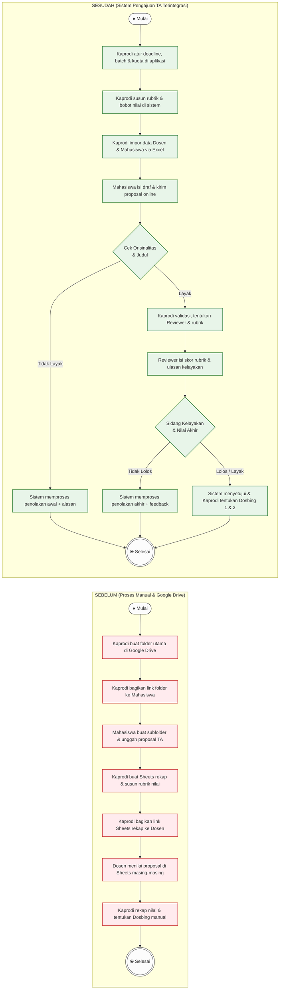

# Perbandingan Alur Kerja: Sebelum vs. Sesudah Sistem

Dokumen ini membandingkan alur kerja pengajuan proposal Tugas Akhir (TA) mahasiswa sebelum dan sesudah adanya sistem. Perbandingan ini menunjukkan transformasi dari **proses manual berbasis Google Drive & spreadsheet** menjadi **sistem terintegrasi** yang otomatis, aman, dan efisien.

---

## 📊 Flowchart Perbandingan (Mermaid Diagram)

---

## 📝 Tabel Komparasi Alur Kerja

| Aspek Kerja | Sebelum (Proses Manual) | Sesudah (Sistem Terintegrasi) | Keuntungan & Dampak Positif |
| :--- | :--- | :--- | :--- |
| **Inisiasi & Konfigurasi** | Kaprodi membuat folder Google Drive secara manual tiap siklus pengajuan. | Kaprodi mengatur deadline, batch, dan kuota percobaan pengajuan di aplikasi. | Menjamin batas waktu pengajuan secara otomatis dan disiplin. |
| **Pengelolaan Data Master** | Data dosen/mahasiswa diarsip di spreadsheet lokal, rawan terhapus/typo. | Data dosen/mahasiswa diimpor massal dari Excel ke database relasional. | Meningkatkan integritas data dan memangkas waktu input hingga 90%. |
| **Pengunggahan Proposal** | Mahasiswa mengunggah file ke Google Drive publik, rentan konflik akses/modifikasi. | Mahasiswa mengisi form online dan mengunggah file terenkripsi ke storage privat. | Keamanan file terjamin, mencegah manipulasi berkas pasca-pengajuan. |
| **Pemeriksaan & Plagiarisme** | Kaprodi membandingkan kemiripan judul baru secara manual dengan riwayat TA terdahulu. | Sistem mencocokkan orisinalitas judul secara real-time dengan database riwayat TA. | Mempercepat validasi judul dan mendeteksi duplikasi secara instan. |
| **Proses Penilaian** | Dosen menilai pada tab Google Sheets bersama, rentan diintip/diubah pihak lain. | Dosen mengisi rubrik interaktif terenkripsi langsung di dashboard pribadi. | Penilaian rahasia, kredibel, terstruktur, dan bebas risiko manipulasi. |
| **Penetapan Pembimbing** | Kaprodi menetapkan Dosbing secara manual dan mengumumkannya via WhatsApp/Email. | Sistem memperbarui status kelayakan dan memfasilitasi penetapan Dosbing 1 & 2 secara langsung. | Surat Keputusan instan dengan transparansi data bimbingan yang utuh. |

---

## 🚀 Kesimpulan Perubahan

Transformasi alur kerja ini memberikan tiga dampak utama bagi program studi:
1. **Keamanan Data**: Akses penilaian dosen dilindungi dengan sistem otorisasi (RBAC).
2. **Disiplin Waktu**: Pengajuan otomatis dikunci setelah batas waktu (deadline) berakhir.
3. **Transparansi**: Seluruh perubahan terekam (audit trail) untuk mencegah miskomunikasi.
