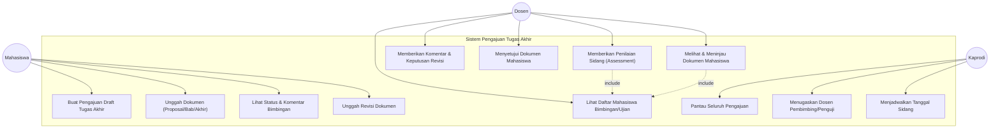

# Use Case Diagram

Diagram ini menunjukkan interaksi antara aktor (pengguna sistem) dengan fungsi-fungsi utama.

```mermaid
flowchart TB
    %% ==========================================
    %% DEFINISI AKTOR (STYLING SEPERTI AKTOR)
    %% ==========================================
    Mahasiswa((Mahasiswa))
    Dosen((Dosen))
    Kaprodi((Kaprodi))

    %% ==========================================
    %% BATAS SISTEM (SYSTEM BOUNDARY)
    %% ==========================================
    subgraph Sistem["Sistem Pengajuan Tugas Akhir"]
        direction TB
        
        %% Use Cases Mahasiswa
        UC1["Buat Pengajuan Draft Tugas Akhir"]
        UC2["Unggah Dokumen (Proposal/Bab/Akhir)"]
        UC3["Lihat Status & Komentar Bimbingan"]
        UC4["Unggah Revisi Dokumen"]

        %% Use Cases Dosen
        UC5["Lihat Daftar Mahasiswa Bimbingan/Ujian"]
        UC6["Melihat & Meninjau Dokumen Mahasiswa"]
        UC7["Memberikan Komentar & Keputusan Revisi"]
        UC8["Menyetujui Dokumen Mahasiswa"]
        UC9["Memberikan Penilaian Sidang (Assessment)"]

        %% Use Cases Kaprodi
        UC10["Pantau Seluruh Pengajuan"]
        UC11["Menugaskan Dosen Pembimbing/Penguji"]
        UC12["Menjadwalkan Tanggal Sidang"]
    end

    %% ==========================================
    %% HUBUNGAN AKTOR KE USE CASES
    %% ==========================================
    Mahasiswa --> UC1
    Mahasiswa --> UC2
    Mahasiswa --> UC3
    Mahasiswa --> UC4

    Dosen --> UC5
    Dosen --> UC6
    Dosen --> UC7
    Dosen --> UC8
    Dosen --> UC9

    Kaprodi --> UC10
    Kaprodi --> UC11
    Kaprodi --> UC12

    %% ==========================================
    %% HUBUNGAN ANTAR USE CASES (INCLUDES / EXTENDS)
    %% ==========================================
    UC9 -.->|include| UC5
    UC6 -.->|include| UC5
```
